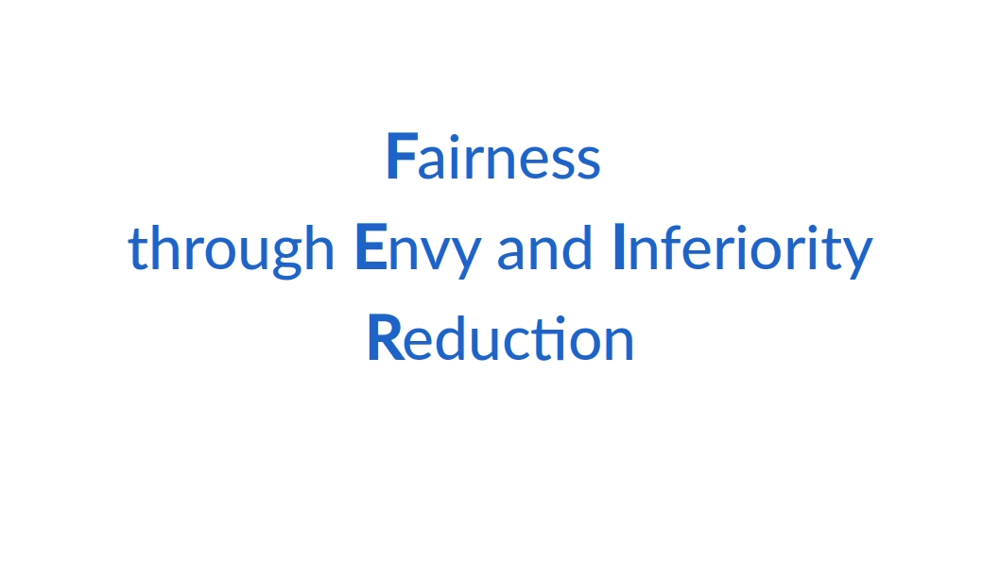

# Fairness through Envy and Inferiority Reduction



## Supplementary document

`suppl.pdf`

## Intruction for reproducing

### Naive recommendation

`python naive_main.py --config-name=naive`

For different dataset, add `datafile=<DATAFILE PATH>`.

### CA baseline

`python skhn_main.py --config-name=sinkhorn_pplgroup`

Change hyperparameters in the config file for different datasets.

### FEIR

`python gd_main --config-name=config`

Change hyperparameters in the config file for different datasets.

## File structure

```shell
|-- suppl.pdf # Extra details and results
|-- configs
|   |-- config.yaml # Example FEIR config
|   |-- naive.yaml  # Example Naive config
|   |-- sinkhorn_pplgroup.yaml  # Example CA configs
|   `-- sinkhorn.yaml 
|-- data
|   |-- mn_size # Random synthetic datasets with varying user-item ratios
|   |   |-- S100by100_norm.pkl
|   |   |-- S100by10_norm.pkl
|   |   |-- S100by20_norm.pkl
|   |   |-- S100by50_norm.pkl
|   |   |-- S10by100_norm.pkl
|   |   |-- S20by100_norm.pkl
|   |   `-- S50by100_norm.pkl
|   |-- P2781by6568_zhilian.pkl # Scores of Zhilian sample
|   |-- P7459by11020_cb.pkl # Scores of CareerBuilder sample
|   |-- S20by100_peoplegroup.pkl # UG 
|   `-- S20by100_skillgroup.pkl # IG
|-- evaluation
|   |-- __init__.py
|   `-- metrics.py
|-- executor
|   |-- __init__.py
|   `-- trainer.py
|-- model
|   |-- base_model.py
|   |-- gd_opt.py
|   |-- __init__.py
|   |-- loss.py
|   `-- sinkhorn.py
|-- utils
    |-- config.py
    |-- data.py
    |-- helpers.py
    |-- __init__.py
    |-- logger.py
    `-- wandblogger.py
|-- __init__.py
|-- gd_main.py  
|-- naive_main.py
|-- skhn_main.py
`-- requirements.txt
```